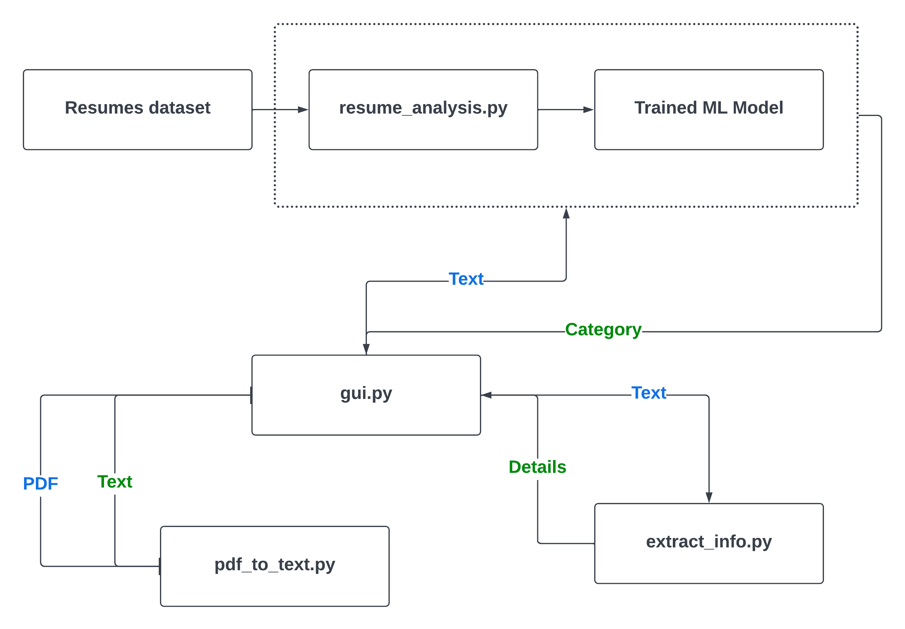
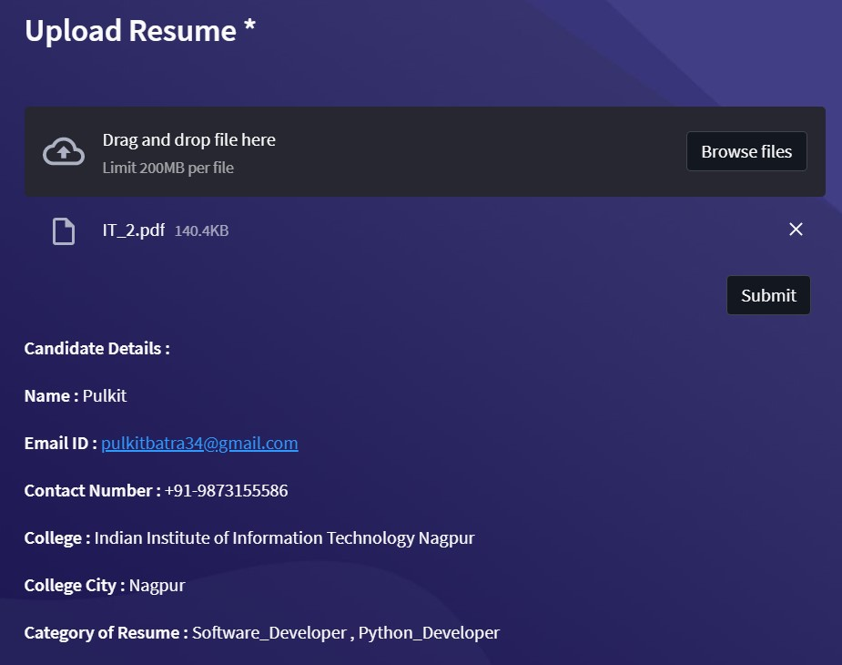

# Resume Exploration

We developed an NLP-based machine learning model that classifies the submitted resume into relevant job profiles and extracts the applicant's details.

We developed a user-friendly GUI-based application with NLP-based machine learning model for uploading resumes and submitting them for analysis  that classifies the submitted resume into relevant job profiles and extracts the applicant's details.

## Requirements
`python3` reference: https://www.python.org/
### Required python modules
* `pandas` reference: https://pandas.pydata.org/
* `sklearn` reference: https://scikit-learn.org/stable/
* `nltk` reference: https://www.nltk.org/
* `pickle` reference: https://python.readthedocs.io/en/stable/library/pickle.html
* `streamlit` reference: https://docs.streamlit.io/
* `pdfplumber` reference: https://github.com/jsvine/pdfplumber

## Running the Application 
- Command: `streamlit run gui.py`
	- Inside the directory where `gui.py` is present
- Command: `streamlit run filepath/gui.py`
	- Use relative path _(as `filepath`)_ of `gui.py` from the present working directory
- The GUI of the application will be revealed in your default browser

## Code High Level Design
<!--  -->

## Sample Ouput figure.
<!--  -->

